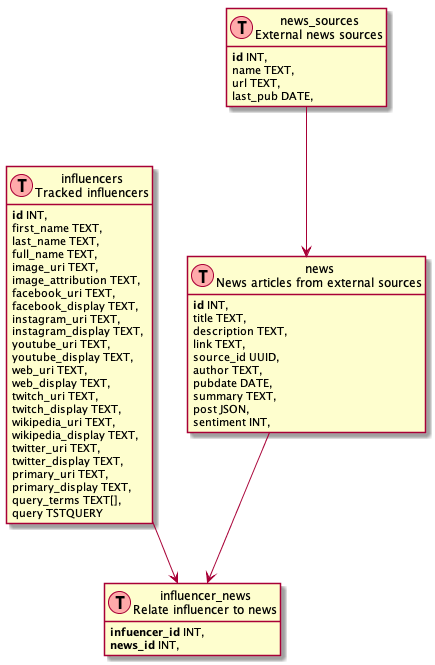

# Description
WhatInfluence is a personal project created to track social media influences in the news, aggregate that news, and assign a score to indicate whether their influence has had a positive or negative impact on society. The wip site can be found here: http://whatinfluence.com/ where it is currently successfully aggregating sales on Ninja blenders (and occasionally news about the popular streamer "Ninja" as well). Making this repository public in case someone has an use for it. Yes there's a password in the server env.example. No, it isn't a real password.

## Server Data Model
Stores data from news feeds for processing

